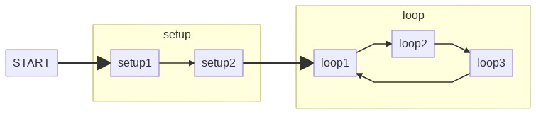

# IOC [MU4IN109] - Micro projet

Réalisé par :

- **Haitham OUERSIGHNI M1 SAR**
- **Aliocha AMERGÉ M1 SAR**

Lien du projet : https://github.com/AliochaAMERGE/Project_IOC

Ce projet a été réalisé dans le cadre de l'UE IOC (MU4IN109) du master 1 Informatique mention SAR de *Sorbonne Université*.

<div style="page-break-after: always;"></div>

# Table of contents

- [IOC [MU4IN109] - Micro projet](#ioc--mu4in109----micro-projet)
- [Table of contents](#table-of-contents)
- [Introduction et format du projet](#introduction-et-format-du-projet)
  * [Les consignes :](#les-consignes--)
  * [Nos objectifs :](#nos-objectifs--)
  * [Matériel utilisé :](#mat-riel-utilis---)
- [Mise en place du broker](#mise-en-place-du-broker)
- [ESP32](#esp32)
- [website](#website)
  * [installation du serveur Django](#installation-du-serveur-django)
  * [création de la base de donnée](#cr-ation-de-la-base-de-donn-e)
  * [connection entre la base de donnée et l'esp via le broker](#connection-entre-la-base-de-donn-e-et-l-esp-via-le-broker)
  * [partie java script et frontend](#partie-java-script-et-frontend)
- [conclusion](#conclusion)
- [pour aller plus loin](#pour-aller-plus-loin)
- [sources](#sources)

# TODO CONSIGNE POUR EXECUTER LE CODE ET LECTURE DU README


# Introduction et format du projet 

## Les consignes :

&emsp;Le micro-projet consiste à mettre en place un serveur HTTP sur une rasperrypi. 
Ce serveur devra afficher des données envoyées par l'ESP32, et permettre d'envoyer des messages à afficher sur l'écran OLED de l'ESP32.
Les données envoyées seront les valeurs de la photorésistance.

## Nos objectifs :

&emsp;Au cours de ce micro-projet, nous voulons faire communiquer un ESP32 avec un raspberrypi, et ce au travers d'un broker MQTT.
L'objectif est donc de récupérer les valeurs de la photorésistance de l'ESP32, les envoyées au broker MQTT implémenter sur le raspberrypi,
qui à son tour, transfère les données sur le site web implémenter également sur le raspberrypi.
Nous voulons également récupérer des *commandes* (des messages) depuis un formulaire sur le site web, qui effectuerons diverses actions sur l'ESP32.


## Matériel utilisé :

&emsp;Au cours de ce micro-projet, nous utiliserons :
- Un [ESP32 + LoRa](https://randomnerdtutorials.com/ttgo-lora32-sx1276-arduino-ide/) avec un écran OLED intégré (modèle TTGO LoRa32 SX1276 OLED). 

- Un [raspberry pi 3 modèle B](https://www.raspberrypi.org/products/raspberry-pi-3-model-b/) avec [Raspberry Pi OS](https://www.raspberrypi.org/software/operating-systems/#raspberry-pi-os-32-bit) (anciennement Raspbian) installé.

- Un serveur utilisant le framework python [Django](https://www.djangoproject.com/)

- Un broker MQTT [Mosquitto](https://mosquitto.org/)

# Mise en place du broker

## Qu'est ce qu'un broker MQTT ?

&emsp;MQTT (message Queuing Telemetry Transport) est un protocole de messagerie qui fonctionne sur le principe de souscription / publication. [[1]](https://projetsdiy.fr/mosquitto-broker-mqtt-raspberry-pi/)
Concrêtement, le broker MQTT fait office d'intérmédiaire entre différents clients. Lorsque qu'un client s'**abonne** (subscribe) sur un **topic**, le broker lui transmettra tous les messages **publié** (publish) par d'autre client sur ce **même topic**. Les topics sont liés au broker, il n'y aura pas de conflit si nous utilisons deux fois le même topic sur deux brokers différents, ces deux topics seront distincts.


*Fonctionnement d'un broker* : nous avons deux clients (4 et 5) abonnés sur deux topic */data/A* et */data/B* et trois clients (1, 2 et 3) publiant des messages sur les topics */data/A* et */data/b*. 
Le broker transférerant tous les messages du client 1 et 3 aux client 4 et 5, et tous les messages des clients 2 et 3 au client 4.

Dans ce micro-projet, le schéma sera le suivant : 


Le raspberry héberge le broker MQTT et le site web. L'ESP32 produit les données via sa photorésistance.
Les données de la photorésistance sont envoyé au broker via le topic `esp32/output` (valeurs entre 0 et 4000).
L'utilisateur à la possibilité d'effectuer différentes actions pré-configurée sur l'esp32 (allumer ou éteindre la LED, afficher un message sur l'écran OLED) directement depuis le site web. Nous utiliserons le topic `esp32.input`.

## Installation du broker MQTT sur la raspberry

&emsp;Nous utilisons un broker MQTT [Mosquitto](https://mosquitto.org/) intégré au raspberrypi.

Source pour reproduire l'installation : 
https://appcodelabs.com/introduction-to-iot-build-an-mqtt-server-using-raspberry-pi

- 1. Installation de Broker MQTT Mosquitto

`sudo apt install mosquitto mosquitto-clients`

- 2. Activation du broker mosquitto
    
Active le broker et l'autorise à se lancer automatiquement après avoir redémarrer le raspberry
`sudo systemctl enable mosquitto`

Si la connection est refusée lors d'un abonnement ou une publication, il peut être nécéssaire de redémarrer le démon mosquitto :
`mosquitto -d`

- 3. *Subscribe* à un topic MQTT (localement)

Nous effectuerons ces commandes sur deux terminaux distincts :
Sur le terminal 1, abonnement au topic `test/message` :
`mosquitto_sub -h localhost -t "test/message"`

Sur le terminal 2, nous publierons "Hello World" sur le topic `test/message` : 
`mosquitto_pub -h localhost -t "test/message" -m "Hello, world"`

> Hello, world apparait sur le Terminal 1

Notre broker Mosquitto est opérationnel, mais pour le moment il n'est accessible que localement. Dans le cadre du projet, nous le laisserons tel quel, mais pour une utilisation plus poussée, il sera nécéssaire d'ouvrir les ports pour un accès depuis l'extérieur (par exemple si nous hébergons le site via un service de cloud distant)

Notre serveur MQTT étant installé sur le raspberry, il nous faut récupérer l'adresse de ce dernier pour pouvoir y accéder (même localement il est nécéssaire de le différencier d'autre appareil).
Pour ce faire nous récupérons l'adresse avec :
`hostname -I`
Si le broker est installé sur Windows, il faudra utilisé la commande : 
`ipconfig`

Cette adresse sera utile à tous moment lorsque nous voulons converser avec le broker MQTT.


# ESP32

&emsp;Nos objectifs sur l'esp32 sont de gérer deux topics : `esp32/output` duquel nous enverrons les données de la photorésistance, et `esp32/input` duquel nous recevrons des *commandes* ayant différentes actions.

Nous utiliserons [Visual Studio Code](https://code.visualstudio.com/) avec l'extension intégrant l'IDE [PlatformIO](https://platformio.org/) pour réaliser toute la partie sur l'ESP32.
Cette extension est extrêmement compléte et bien documentée, la gestion des librairies est simplifiée, et toutes les opérations sont intuitives et ou documentée.

Nous aurons besoin d'importer 3 librairies :
- PubSub : pour gérer la communication avec le broker
`pio lib install "knolleary/PubSubClient"`
- Adafruit GFX Library : librarie graphique
`pio lib install "adafruit/Adafruit GFX Library"`
- Adafruit SSD1306 : librairie de driver oled SSD1306 pour des écrans monochrome 128x64 et 128x32
`pio lib install "adafruit/Adafruit SSD1306"`

Nous utiliserons également les libraires suivantes :
`Arduino.h`, `WiFi.h`, `SPI.h` et `Wire.h`

## Déroulement de l'algorithme

- **Programmation sur Arduino (esp32) :**

La programmation sur esp32 fonctionne de la même façon que la programmation sur Arduino :
Le code nécéssite deux méthodes : `void setup();` et `void loop();`

  - `void setup();`

Le code sera éffectué une fois au démarrage de l'esp32, il sert notamment à l'initiatlisation des variables, ou toutes actions que nous ne réalisons qu'une fois.
Nous pouvons appeler d'autre méthodes dans le `setup()`, ces méthodes seront executée une unique fois.

  - `void loop();`

Le code sera effectué périodiquement, c'est en quelque sorte un `while(true)`. Nous réalisons les différentes actions de notre code dans cette méthode. 
Nous pourrons appeler d'autre méthodes dans le `loop()`, ces méthodes seront exécutée séquentiellement jusqu'à arrêt du programme.

Les programmes Arduino peuvent en gérénal est réprésenté sous la forme de diagramme d'état, en voici un exemple :



*Ici, nous avons 2 méthodes appelées dans le setup(), et 3 méthodes dans le loop().*

- **Notre implémentation :**

Fichier : [*esp32/src/main.cpp](esp32/src/main.cpp)

**Les variables**

```cpp
// Le broker
WiFiClient espClient;
PubSubClient client(espClient);
// l'écran
Adafruit_SSD1306 display
```

**setup()**
```cpp
void setup(){
  // Connection au WiFi
  ConnectWifi();
  // Connection au broker MQTT & subscribe aux topics désirés
  ConnectMQTT();
  // et c'est tout, les autres fonctionnalités sont gérée dans ConnectMQTT()
}
```
**loop()**

```cpp
void loop(){
  // se reconnecter au broker en cas de déconnection
  if (!client.connected()) {
    reconnect();
  }
  // l'attente de réception des messages du broker
  client.loop();

  /**** Envoie des messages sur esp32/output ****/
  /*    expliciter dans une prochaine partie    */
}
```

## Connection au broker MQTT

### Connection WiFi

Afin de nous connecter au broker MQTT, nous aurons tout d'abord besoin de nous connecter au WiFi.
Pour cela, nous aurons besoin de la librairie `WiFi.h` :
Fichier : [*esp32/include/WifiConfig.h*](esp32/include/WifiConfig.h)

```cpp
void connectWifi(void) {
  // connection en fonction des identifiants et mot de passe fournis
  WiFi.begin(SSID, WiFiPassword);
  // Attente bloquante tant que la connection n'a pas abouti
  while (WiFi.status() != WL_CONNECTED) {
    delay(500);
  }
}
```

Les identifiants (SSID) et mot de passe (WiFiPassword) seront indiqués dans le fichier */esp32/include/WiFiCredentials.h* contenant ces deux variables :
```cpp
const char *SSID = "xxxxxxx";
const char *WiFiPassword = "xxxxxxxx";
```

**ATTENTION : Ce dernier devra être créé par l'utilisateur, et modifier en cas de changement de réseau WiFi**

### Connection au broker MQTT

Une fois la connection WiFi établie, nous pouvons nous connecter au broker MQTT.
De la même manière que le WiFi, les informations de connection seront stockées dans un fichier */esp32/include/MQTTCredentials.h* contenant : 
```cpp
const char* mqtt_server = "xxx.xxx.x.xx";
const int mqtt_port = 1883;  // port par défaut
```

```cpp
// Connection au serveur 
client.setServer(mqtt_server, mqtt_port);
// Gestion du callback
client.setCallback(callback);
// abonnnement au topic esp32/input
client.subscribe("esp32/input")
```
La méthode `setCallback()` prend en paramètre un pointeur sur fonction et indiquera la procédure à réaliser en cas de réception d'un message. Nous expliciterons cette méthode ultérieurement.

La souscription sera également explicitée par la suite.

En cas de déconnection au serveur, la méthode `void reconnect()` est appelée : 
```cpp
void reconnect() {
  // Loop until we're reconnected
  while (!client.connected()) {
    Serial.print("Attempting MQTT connection...");
    // Attempt to connect
    if (client.connect("ESP8266Client")) {
      Serial.println("connected");
      // Subscribe
      client.subscribe("esp32/input");
    } else {
      Serial.print("failed, rc=");
      Serial.print(client.state());
      Serial.println(" try again in 5 seconds");
      // Wait 5 seconds before retrying
      delay(5000);
    }
  }
}
```
Nous relançons tout simplement la connection au serveur, ainsi que les abonnements aux topics nécéssaire.

A ce niveau, nous avons établis une connection au WiFi et au broker MQTT, mais nous ne recevons ni n'envoyons de données vers ce dernier, c'est ce que nous verrons par la suite.

Nous mettons en place maintenant deux topics, un pour les messages entrants, et un pour les messages sortants.

## esp32/output

Ce topic concerne les données *sortantes* de l'esp32 vers le site web, c'est à dire dans notre implémentation, les valeurs captée par la photorésistance.
Cette valeurs lu toutes les secondes, puis envoyé au broker :
```cpp
long now = millis();
if (now - lastMsg > 1000) {
  lastMsg = now;
  lumos = analogRead(PHOTORESISTANCE_PIN);

  /* Convert the value to a char array */
  char tempString[8];
  dtostrf(lumos, 1, 2, tempString);
  Serial.print("value = ");
  Serial.println(tempString);

  client.publish("esp32/output", tempString);
}
```
Nous verifions si le délai d'une seconde depuis le dernier envoie est atteint (d'une manière très similaire au waitFor() vu au cours du TME 3).
Ensuite nous récupérons la valeurs de la photorésistance avec `analogRead(byte pin)`. Cette valeurs est comprise entre 0 et 4000 (du plus clair au plus sombre). Elle est ensuite convertie en une chaine de caractère, puis publiée sur le topic `esp32/ouput`.

## esp32/input

Ce topic concerne les données *entrantes* vers l'esp32 depuis le site web, ce sont des *commandes* depuis le site web.
Pour le moment, nous avons 3 commandes mise en place :
- LedOn : allume la Led
- LedOff : éteint la Led
- autre : affiche le contenu du message sur l'écran OLED

Ces messages sont gérer dans la fonction `callback()` précedemment énoncé :

```cpp
void callback(char* topic, byte* message, unsigned int length) {
  
  // permet de traduire le message (tableau de byte) en String
  String messageTemp = "";
  for (int i = 0; i < length; i++) {
    messageTemp += (char)message[i];
  }
  pinMode(LED_BUILTIN, OUTPUT);

  // Si nous recevons un message du topic esp32/input
  if (String(topic) == "esp32/input") {
    // si message est la commande "LedOn"
    if (String(messageTemp) == "LedOn") {
      // on allume la LED
      digitalWrite(LED_BUILTIN, HIGH);
    } else
    // si message est la commande "LedOff"
     if (String(messageTemp) == "LedOff") {
      // on éteint la LED
      digitalWrite(LED_BUILTIN, LOW);
    } else {
      // on affiche le contenu du message sur l'écran Oled
      display.clearDisplay();       // efface le display
      display.setCursor(20, 10);    // place le curseur
      display.println(messageTemp); // écrit le message dans le buffer
      display.display();            // affiche le contenu du buffer
    }
  }
}
```
L'abonnement au topic `esp32/input` se fait à la connection et / ou à la reconnection au broker MQTT.

Le code est plutot explicite, lors de la récetion d'un message, nous le convertissions en String, si le topic du message est `esp32/input`, nous le traitons.
Cette verification est utile si nous nous abonnons à plusieurs topics (ce qui n'est pas le cas dans notre implémentation).
Nous passons le mode du pin concernant la Led en OUTPUT afin de pouvoir écrire une valeurs (HIGH ou LOW), si nous recevons "LedOn" nous allumons la Led, et inversement si nous recevons "LedOff". Si nous recevons un autre message, ce dernier sera afficher sur l'écran (ne fonctionne que pour des messages relativement court pour le moment, mais cela est facilement modifiable en fonction des besoins).

Pour utiliser l'écran, nous avons besoin de réaliser plusieurs opérations sur ce dernier au préalable qui sont expliqués dans le lien suivant : https://mansfield-devine.com/speculatrix/2019/01/ttgo-esp32-oled-display/

# TODO image montrant un affichage sur lécran OLED

## Limites de l'implémentation

- Problème : 

Cette implémentation montre tout de même quelques défauts. Tout d'abord, il est nécéssaire de rentrer les identifiants et mots de passe du WiFi et du broker *en dur* à chaque changement de réseau WiFi ou de broker. En cas de partage du code, ces données apparaissent en clair et ne sont pas criptées, ce qui peux provoquer un risque d'un point de vue sécurité.

- Idée de résolution :

Il faudrait chiffré les identifiants en utilisant une clé de chiffrement propre aux utilisateurs, mais cela demande d'implémenter un algorithme suplémentaire pour déchiffrer ces données, propre à chaque personne, ce qui ne rend pas le code plus facilement distribuable.
Nous pourrions également faire une demande d'argument à l'exécution, ce qui serait plus simple mais non persistant.

- Problème :

Nous faisons face à des déconnection récurrente, et des retards dans les envoies / réceptions de messages en lien avec le broker.

- Idée de résolution :

Celà est peut-être lié à un problème de performance matériel, auquel cas le seul changement possible est de changer de modèle d'ESP32. Sinon, le problème est lié à une instabilité du réseau (ce qui est improbable dans les conditions de test).

## Résumé

L'implémentation sur l'esp32 est terminée.
Nous avons connecté l'esp32 au WiFi et au broker MQTT.
Nous avons créer deux topic, un pour les messages entrants (`esp32/input`), un pour les messages sortants(`esp32/ouput`).
Le topic pour les messages sortants concerne les valeurs de la photorésistance, le topic concernant les messages entrants concerne des commandes traitées par l'esp32.
Ces commandes sont  { "LedOn" : allume la Led, "LedOff" : éteint la Led, "autre" : affiche la commande sur l'écran.

# Website

Nous attaquons la partie le plus conséquente de ce micro-projet, et celle qui nous a demandé le plus de temps, et le plus de lecture de documentation. Nous n'expliciterons pas toutes les étapes de notre cheminemant afin de créer le site car la rapport serait bien trop long. Nous indiquerons donc dans la mesure du possible la doc / les tutoriels afin de reproduire les étapes, et nous prendrons au maximum appuie sur le code.

## Objectifs

Nous voulons faire un serveur HTTP récupérant les données émises par l'esp32 via le broker MQTT. Nous voulons également pouvoir envoyé des commandes via un formulaire, sur l'ESP32, toujours au travers du broker.

Pour ce faire nous avons décidé d'utiliser le [framework Django](https://www.djangoproject.com/)

## Installation du serveur Django

### Pourquoi Django ?

Nous avons choisis d'utiliser Django pour plusieurs raisons :

- Framework reconnu et beaucoup utilisé : 

Apprendre à créer un serveur Django est beaucoup demandé, et nous sera toujours utilse d'un point de vue professionnel, et personnel si nous voulons complexifié notre serveur.

- Performance : 

Nous faisions face à des soucis de performance et de forte utilisation des ressources matérielles lors de la mise en place d'un serveur HTTP *basics*. Ces problèmes n'ont pas été apperçu avec le serveur Django.

- Faciliter d'impléméntation : 

Au début de ce projet, nous pensions que le site web serait un *support* et que le partie importante du code était sur l'esp32, nous nous étions lourdement trompé. Le framework étant implémenter en python, déstiné au *grand public*, et disposant d'une documentation riche (ainsi que d'une grande variété de ressources tierces en ligne), l'implémentation du serveur est très simple.

### Création du serveur Django

La création du serveur Django se base grandement sur cette playlist youtube par [HackerShack](http://www.thehackershack.com/) : https://www.youtube.com/embed/videoseries?list=PL39pssg07dpDJas1vxb7Dyw5f8SkAw6c-

- Mise en place d'un environnement virtuel python :

*Pourquoi* ? Afin de faciliter les dépendances, les librairies, leurs versions, et la vesion de python.
Python 2 et python 3 n'étant pas retro-compatible, il est parfois nécessaire de forcer un environnement pour éviter tout problème de compatibilité.

Pour créer un environnement virtuel, nous utiliserons [*pyenv*](https://github.com/pyenv/pyenv) ([lien pour l'installation sous Ubuntu](https://www.liquidweb.com/kb/how-to-install-pyenv-on-ubuntu-18-04/)) suivi de [*pyenv virtualenv*](https://github.com/pyenv/pyenv-virtualenv) ([lien pour l'installation sous Ubuntu](https://www.liquidweb.com/kb/how-to-install-pyenv-virtualenv-on-ubuntu-18-04/)).

Nous créons un environnement que nous appelerons `DjangoWebsite@3.7.3` sous python 3.7.3.

Nous ajouterons également un dossier `/requierements/` contenant deux fichiers : `dev.txt` et `prod.txt` afin de gérer les dépendances du serveur à l'aide de la commande `pip install -r dev.txt`.

- Mise en place du serveur Django

Nous installerons ensuite la librairie Django avec `pip install Django`. Dependance que nous ajouterons à `prod.txt`.

Nous créons ensuite un projet Django avec la commande `django-admin startproject pioc_website` ce sera notre site web. Au sein de ce site, nous créons une application que sera propre à ce projet, nous l'avons appeler *myapp* (le non aurai pu être mieux choisis) `./manage.py startapp myapp`. 
Nous migrons ensuite l'application que nous venons de créer : `./manage.py migrate`. Les migrations sont la manière par laquelle Django propage des modifications que nous apportons à des modèles (ajout d’un champ, suppression d’un modèle, etc.) dans un schéma de base de données.[[*](https://docs.djangoproject.com/fr/3.2/topics/migrations/)]

Nous avons l'arborescence de notre site :
```
.
├── manage.py
├── myapp
├── pioc_website
└── requirements
    ├── dev.txt
    └── prod.txt
```
Des étapes sont nécessaire pour ajouter nos applications nouvellement crée au serveur Django, elles sont très bien expliquée sur la [vidéo suivante](https://www.youtube.com/watch?v=PqeAvFf_HDI) : 

- Arborescence détaillée du serveur Django :
```
.
├── db.sqlite3  ~ la base de donnée expliqué plus tard dans le rapport
├── manage.py   ~ gestion du serveur, ex : "./manage.py runserver" pour démarrer le serveur
├── myapp       ~ application énoncée ci-dessus, les opérations sont réalisé ici
│   ├── admin.py  ~ gestion administrateur de l'app, auto générér non modifié
│   ├── apps.py   ~ paramètre de l'app, auto générér non modifié
│   ├── __init__.py  ~ programme python exécuter au démarrage du serveur, 
|   |                               explicité plus tard dans le rapport
│   ├── migrations   ~ dossier auto générer gérant les migrations
│   │   └── [...]  
│   ├── models.py    ~ création des tables pour la base de donnée
│   ├── mqtt_input.py  ~ programme appelé dans __init__ 
│   ├── __pycache__  ~ cache
│   │   └── [...]
│   ├── templates
│   │   └── index.html
│   ├── tests.py  ~ Programme pour test, non utilisé
│   ├── urls.py   ~ Gestion des routes du serveur (en partant de la route de myapp)
│   └── views.py  ~ Gestion des rendus du serveur associé aux routes
├── pioc_website   ~ Le serveur Django ~
│   ├── asgi.py  
│   ├── __init__.py  ~ même chose que myapp, non exploit
│   ├── __pycache__  ~ cache
│   │   └── [...] 
│   ├── settings.py   ~ paramètre du serveur, nous indiquerons les app et les paths utile au serveur
│   ├── urls.py   ~ route du serveur, nous définirons myapp comme la route principale
│   └── wsgi.py
├── requirements   ~ dépendances du serveur
│   ├── dev.txt
│   └── prod.txt
└── static     ~ Dossier contenant les élements statics pour les rendus (images, CSS, javascripts)
    └── [...]
```

Pour lancer le serveur, nous utiliserons : `./manage.py runserver` 

Tout d'abord, nous ajoutons une route vers *myapp*, ce sera la route par défaut :

Dans le fichier [pioc_website/urls.py](/website/pioc_website/urls.py), nous ajouterons `path("", include("myapp.urls"))` dans la liste des *urlpatterns*.

Dans myapp, nous ajoutons la *view* index à la route par défaut.
Dans le fichier [myapp/urls.py](/website/myapp/urls.py), nous ajouterons `path("", views.index, name="index")` dans la liste des *urlpatterns*.

Dans le fichier [myapp/views.py](website/myapp/views.py), nous ajoutons une méthode afin de générer le rendu, nous appelerons un fichier `index.html` que nous ajouterons dans le dossier `myapp/template/`.
Le contenu de ce fichier sera explicité plus tard.

Si nous lançons le serveur, à l'adresse `localhost:8000`, le contenu de `index.html` devrait s'afficher.

La base de notre serveur est en place.

## Implémentation d'une base de donnée

Notre prochaine étape consiste à mettre en place une base de donnée dans le serveur Django.
Cette base de donnée permettra de garder en mémoire les données reçu du broker MQTT, et ce même après avoir éteint le serveur.
De plus lors de la réception d'un message du broker MQTT, la donnée sera directement ajoutée dans la base de donnée. Et ensuite des requêtes vers cette base de donnée seront effectuée pour récupérer des valeurs et les affichées sur le site, mais nous verrons cela plus tard.

Notre base de donnée contient une unique table contenant les attributs suivant : 
- Un identifiant unique s'incrémentant à chaque nouvelle entité.
- Une chaine de caractère *id_esp* symbolisant l'identifiant de l'esp d'où provient la valeurs
    (ne travaillant avec un unique esp, nous l'avons identifié par esp-test, mais nous pourrons récupérer l'identifiant via le broker à terme)
- Une date de publication *pub_date* si nous voulons réaliser une requête sur une interval de date, mais ce type de requête n'est pas encore implémenter
- Un entier symbolisant la valeurs de la photorésistance 

Cette table a été défini dans le fichier [*/myapp/models.py*](website/myapp/models.py) de la manière suivante :

```py
class Data(models.Model):
    # Identifiant générer implicitement
    # identifiant propre à l'esp (en cas de connection de plusieurs esp)
    id_esp = models.CharField(max_length=200)
    # date de la donnée
    pub_date = models.DateTimeField(auto_now_add=True)
    # valeurs de la donnée (0,4000)
    value = models.IntegerField()
```

Cette table s'appelle `Data` et étend `django.db.Model`. Les identifiants sont générer implicitement de manière unique, et les dates sont indiquées lors de la création d'une nouvelle entité dans la table.

Nous avons besoin de migré la table après création comme indiqué dans la [vidéo suivante](https://www.youtube.com/watch?v=PqeAvFf_HDI) précédement utilisée.

Les nouvelles entités sont créer à la réception d'un message du broker, et sont utilisée lors de l'affichage de la page HTML, ces deux aspects seront explicités ultérieurement.

- Avantages :
  - pérsistance des données
  - accès faciliter au travers de requetes ([queries](https://docs.djangoproject.com/fr/3.2/topics/db/queries/))
  - Opérations supplémentaires plus facilement implémentable (Par exemple nous voulons la moyenne des valeurs de la photorésistance entre 9h et 19h en semaine, nous pourrons le faire avec une requête SQL les données étant deja en place)
  - administration de ces données facilitée grâce au framework Django : accès via `localhost:8000/admin`


*Présentation de la page d'administration du serveur Django, Datas étant notre table.*

- Inconvénients :
  - La table ne se vide pas automatiquement, mais cela peut etre implémenter si nous avons des données plus conséquentes. Cela peut etre problématique si le serveur est lancé en permanence, il créé une nouvelle entité toutes les seconds.

Nous verrons maintenant comment cette base de données est remplie.

## connection entre la base de donnée et l'esp via le broker

Nous avons maintenant le coeur de notre site opérationnel, il nous faut maintenant récupérer les données de notre broker MQTT, et les ajouter dans la base de donnée. Pour celà nous utiliserons la librarie python [*paho-mqtt*](https://pypi.org/project/paho-mqtt/).
Nous devons donc d'abord installer la libraire :
`pip install paho-mqtt`

Puis l'ajouter dans la liste des *requierements*.

### esp32/output

Nous voulons lancer la connection au démarrage du serveur, la reception des messages se faisant dans la *back end*. C'est à ce moment que [/myapp/\_\_init__.py](website/myapp/__init__.py) fait sont entrée.

Les méthodes appelés dans *\_\_init__* sont lancée au démarrage du serveur, et ce quoi qu'il arrive.

Nous avons d'abord créé un fichier [myapp/output.py](website/myapp/output.py) pour gérer les données entrante sur le serveur (c'est à dire sortante de l'esp32 sur le topic *esp32/output*).

```py
# after conenecting to the MQTT broker
def on_connect(client, userdata, flags, rc):
    from .models import Data  # fix Apps aren't loaded yet

    client.subscribe(topic="esp32/output")

# upon message receipt
def on_message(client, userdata, msg):
    # fix Apps aren't loaded yet
    from .models import Data 
    # decode the message in order to use it (byte array -> String(utf-8))
    temp = msg.payload.decode("utf-8")
    # create a new entity in the table Data
    Data.objects.create(id_esp="esp-test", value=float(msg.payload.decode("utf-8")))

# create a new MQTT client
client = mqtt.Client()
# execute on_connect when connected
client.on_connect = on_connect
# execute on_message when receiving a message
client.on_message = on_message

# inititate connection
client.connect("192.168.1.46", 1883)

```

Lors de la connection au broker, nous nous abonnons au topic `esp32/output` pour recevoir les données de l'esp32.

Lors de la réception d'un message, nous créons une nouvelle entité dans notre table avec la valeurs récupérée du message. L'identifiant de l'esp32 est entré "*en dur*" pour le moment, mais nous pouvons utilisé le champs *userdata* pour avoir un identifiant plus cohérent.

L'adresse du broker est également entrée "*en dur*", il serait fortement envisageable de la paramétrée au lancement du serveur Django via des arguments, ou une lecture de fichier.

Dans le fichier [/myapp/\_\_init__.py](website/myapp/__init__.py), nous appelons `mqtt_output.client.loop_start()` afin de lancer la boucle d'attente des messages.

Nous noterons la grande similarité des méthodes entre le code sur l'esp32 et celui ci : on_message <-> callback; mqtt_output.client.loop_start() <-> client.loop() etc ...

Notre base de donnée se rempli au fur et à mesure de la réception des messages.

- Limites de notre implémentation :

Si un message arrive sur le topic `esp32/output` contenant autre chose qu'un entier, une erreur de conversion sera lancée.

### esp32/input

Nous voulons à présent envoyer des données depuis le site web vers l'esp32, pour cela nous utiliserons le topic `esp32/input`.

Nous utiliserons à nouveau la librairie paho-mqtt, mais cette fois-ci en javascript : 

```js
jQuery(document).ready(function($) {
  var client;
  // broker ip adress
  var host = "162.168.1.46";
  // broker port
  var port = 1883;

  // after conenecting to the MQTT broker
  function onConnect(){
      console.log("Connected");
      // set topic
      message.destinationName = "esp32/input";
      // first turn off the led
      client.send("LedOff");
  }
  // inititate connection
  function MQTTconnect(){
      console.log("connecting to "+host + " "+ port);
      // new connection
      client = new Paho.MQTT.Client(host,port,"clientJS");
      var option = {
          timeout: 3,
          onSuccess: onConnect,
      };
      // connect
      client.connect(option);
  }

  MQTTconnect();

  // react to the button, has been changed to a form
  $('#switchLed').click(function() {
      if($('#switchLed').is(':checked')){
          // if switch is on, turn on the led 
          document.getElementById('actualLed_val').innerHTML = 'On';
          client.send("LedOn");
      }else{
          // if switch is off, turn off the led
          document.getElementById('actualLed_val').innerHTML = 'Off';
          client.send("LedOff");
      }
  });
});
```
Nous remarquons qu'une fois de plus les méthodes sont similaire aux précédentes implémentations.
Malheuresement cette implémentation ne fonctionnait pas, les connections au broker MQTT étaient refusée et nous n'avons pas réussi à résoudre le problème.

Nous avons donc décidé d'implémenter l'envoie de commande à la réception d'une requete "*POST*".
Nous avons un entrelacement du *front end* provenant du fichier HTML, avec le *back end* gérer par le serveur Django.
Nous utiliserons un [formulaire HTML](https://docs.djangoproject.com/fr/2.2/topics/forms/).

Nous verrons son implémentation dans la partie HTML plus tard, grossièrement, lorsque l'utilisateur entre des données dans le formulaire, une requete "*POST*" est envoyée, cette dernières est récupérée dans [/myappp/views.py](website/myapp/views.py) :

```py
def index(request):
  # si une donnée est entrée dans le formulaire  
  if request.method == 'POST' and 'esp32_input' in request.POST:
      # etablie une connection temporaire et publie le contenu de la requete dessus
      publish.single("esp32/input", request.POST.get("esp32_input"), hostname="192.168.1.46")
  # charge le template
  template = loader.get_template("index.html")
  # récupère la derniere valeurs de la base de donnée
  data = Data.objects.order_by("-pub_date").all()[0]
  # affiche le rendu
  return render(request, "index.html", {f"value": data.value})
```

Nous n'avons pas besoin de maintenir une connection constante avec le broker car les envoies de commandes seront isolées, nous publions sur le topic `esp32/input` la commande entrée par l'utilisateur, et nous déconnectons proprement.

- Inconvénients :
  - Lors d'un envoie de commande, un nouveau rendu de la page est réalisé ce qui provoque une *actualisation*.
  - Si nous avons plusieurs esp32 sur la meme route, nous aurons besoin d'indiqué l'identifiant de l'esp concerné par la commande, ou d'utilisé plusieurs routes.

- Idée de fonctionnalité :
  - Ajouter une table supplémentaire contenant l'historique des commandes.

## partie java script et frontend

Nous attaquons maintenant la partie visible de l'iceberg qu'est notre projet. Le *front end*.

Nous n'utiliserons qu'une route, et un unique fichier HTML. Toutes les autres routes seront des *utilitaires*.

### HTML

Ce fichier contiendra l'ensemble des données affichée sur notre page Web tel que vous pouvez la voir.
Ces données sont séparée en plusieurs sections :

#### Le titre et les imports

#### Le sommaire

#### La valeurs de la photorésistance

#### La valeurs de la Led

### views

### /data

### Live data


Récupération des données de la BDD et création de la route /data en json

views python
html
css
js et graphe

limite du graphe

# conclusion

resumé de ce que nos avons fait tres rapidement

les connaissances que nous avons acquise
  MQTT broker
  python
    class init
  django
    gestion d'un serveur des urls et des vue
  html et css
  js
  utilsation d'un esp et d'un raspberry
  connection sur un raspberry
  clé ssh et gestionnaire dans le .ssh
  platformIO plus en détail
  mermaid pour le rapport

  travail sur un projet tres concret et d'actualité
    des connaissances utiles en tout cas
    confirmation et application des acquis precedents
  
  un projet tres ouvert à notre imagination, beaucoup de chose a faire, et nous n'avons pas pu tout faire cf : aller plus loin

  un  projet utilisant beaucoup de langage d'API et beaucoup docummenté sur le web -> demande beaucoup de recherche et de tri d'information

  en bref un super projet trop interessant, on a vu trop de truc, envie de faire plein de chose, merci monsieur pour tout c'est trop cool

  

# pour aller plus loin 

Ce que nous aurions pu faire si plus de temps / de matos, et comment l'aurons nous fait rapidement

TODO : expliquer plus en détails comment le faire dans la mesure du possible

Ajouter un menu pour ajouter plusieurs esp32, et faire une table par esp32, ou un identifiant et les mettres dans la meme table et gérer plus efficacement les adresses ip des serveurs et ou broker.


Gérer des requetes pour récupérer la moyenne des xx dernieres données, ou des données au cours des xx derniere heure (sql)

faire en sorte que les données du graphique restent inchangées lorsqu'il n'y a pas de nouvelles valers dans la BD
(regarder la date ou id de la derniere valeurs)

utiliser le BP pour activer desactiver le transfert des données sur le broker
creation d'un flag qui passe a vrai si bouton pressé

gérer d'autre capteurs que les photorésistance
tu vois l'idée, faire plus de table en fonction, ou plus d'attribut pour faire des envoies groupé

utiliser le bluetooth plutot que le wifi, pour plus de portabilité
(esp32 sur batterie portable, connection via bluetooth donc pas de MQTT, plus limité mais plus portable)

dans la chart, utiliser les dates plutot que rien actuellement
a groupé avec la requete sql et avoir des moyennes sur la journée, ou un historique exploitable (les dates sont implémentée mais pas utilisée)

# Remerciement
